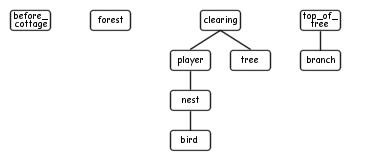
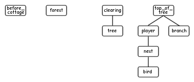
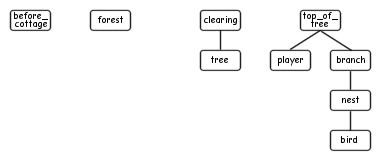

# Обобщение

Теперь пройдёмся более организованно и подробно по тем принципам, что мы увидели в предыдущей главе.

## Константы и переменные

**Константа** это такое имя, значение которого строго задаётся и не может изменяться. Ранее мы встретили строковую константу:

    Constant Story "Хейди";

и числовую константу:

    Constant MAX_CARRIED 1;

Это два наиболее частых способа использования констант в Информе.

Значение **переменной** может изменяться в ходе игры. Мы ещё не задавали собственных переменных, но уже пользовались двумя такими из библиотеки, где они заданы следующим образом:

    Global location;
    Global deadflag;

Значение **глобальной переменной** по умолчанию равно 0, но его можно изменить в любой момент, например мы ввели:

    location = before_cottage;

для изменения ``location`` на ``before_cottage``, а также

    if (nest in branch) deadflag = 2;

для изменения ``deadflag`` на 2.

В других главах будет освещено использование **локальных переменных** и свойств как переменных.

## Описание объектов

Как можно было заметить из предыдущей главы, вся игра описывается в виде объектов. Каждая комната, предмет и даже сам игрок является объектом (объект игрока задаётся библиотекой).

Общий формат задания **объекта** следующий:

    Object идентификатор "игровое_имя" родительский_объект
    with    свойство значение,
        свойство значение,
        ...
        свойство значение,
    has атрибут атрибут ... атрибут
    ;

Описание начинается с ключевого слова ``Object`` и заканчивается точкой с запятой, а между ними идёт три основных блока:

* Сразу за словом ``Object`` идёт заголовочная часть;

* со слова ``with`` начинается перечисление **свойств**;

* со слова ``has`` начинается перечисление **атрибутов**.

### Заголовок объекта

Заголовок состоит из трёх частей, каждая из которых не обязательна:

*   Внутренний идентификатор, по которому другие объекты обращаются к данному объекту. Это должно быть одно слово (можно с цифрами и знаком подчёркивания), до 32 латинских символов, и оно должно быть уникальным в игре. Идентификатор можно опустить, если к объекту не обращаются другие объекты.

    Примеры: ``bird``, ``tree``, ``top_of_tree``.

*   Игровое имя в двойных кавычках. Оно может состоять из нескольких слов и не обязательно быть уникальным (например, можно иметь несколько комнат с именем ``"Где-то в пустыне"``). Не обязательно, но крайне рекомендуется дать каждому объекту игровое имя.

    Примеры: ``"птенчик/"``, ``"высок/ий платан/"``, ``"На верхушке дерева"``.

*   Внутренний идентификатор другого объекта, в котором будет находиться данный в начале игры (такой объект называется «родительским»). Это значение не указывается, если у объекта не будет родительского объекта, а также никогда не указывается для комнат.

    Например, птенчик описывается как:

        Object bird "птенчик/" forest
    
    что означает что в начале игры он будет находиться в лесной чаще (игрок затем подберёт его с собой). Платан описан следующим образом:

        Object tree "высок/ий платан/" clearing
    
    Он будет находиться на полянке, но так как он является ``scenery``, то игрок не сможет его переместить.

    Есть другой способ описания изначального положения объекта, при помощи стрелочек, например так:

        Object -> bird "птенчик/"
        ...

    Мы не будем использовать его в примерах, но тем не менее это довольно удобный и наглядный способ.

### Свойства объектов

Свойства начинаются с ключевого слова ``with``. У объекта может быть любое количество свойств и заданы они могут быть в любом порядке. Сначала идёт имя свойства, затем через пробел его значение, после значения — символ запятой.

Свойства стоит воспринимать как переменные, относящиеся к объекту. Изначально значение равно заданному, но в ходе игры его можно изменять (тем не менее обычно свойства не изменяют). Вот несколько ранее виденных примеров свойств.

    description "Гнездо сплетено из прутиков и аккуратно устлано мхом.",
    e_to forest,
    name 'детеныш' 'птиц' 'птичк' 'птенчик' 'птенц' 'маленьк',
    each_turn [; if (nest in branch) deadflag = 2; ],

В перечисленных примерах встречаются различные варианты значений свойств: ``description`` это строка, со свойством ``e_to`` ассоциирован объект, в свойстве ``name`` идёт список словарных слов, а ``each_turn`` содержит в себе **локальную функцию**. Также значение может быть числовым, например:

    capacity 10,

Существует около 50 стандартных свойств наподобие ``name`` или ``each_turn``. Позже будут рассмотрены самые важные из них, а также то, как задать собственное свойство.

### Атрибуты объектов

Атрибуты начинаются с ключевого слова ``has``. Их может быть любое количество и в любом порядке; друг от друга они отделяются пробелом.

Атрибуты проще свойств — у них нет значения, они могут либо присутствовать, либо отсутствовать (быть включены/выключены). Атрибут можно назвать **флагом**. Изначально если атрибут указан, то он включён (присутствует), если не указан — то выключен (отсутствует).

Ранее мы встретились со следующими атрибутами:

    container light open scenery static supporter

Каждый из них отвечает на вопрос, например, «Является ли объект контейнером?», «Является ли он источником света?» и так далее. Если атрибут указан, то ответом будет «да», если не указан — «нет».

Существует около 30 стандартных атрибутов. Можно также создавать и свои собственные.

## Связи между объектами и дерево объектов

Во время игры Информ следит за связями между объектами — то есть помнит, где находится конкретный объект относительно других объектов. При рассмотрении связей по отношению к объектам используются термины **«родительский»** и **«дочерний»**.

Когда игрок находится в какой-нибудь комнате, например в лесной чаще, то можно сказать следующее:

* объект лесной чащи является родительским для объекта игрока, или что

* объект игрока является дочерним для объекта лесной чащи.

Также если игрок держит в руках объект, например гнездо, то

* объект игрока — родительский для объекта гнезда, или

* объект гнезда — дочерний для объекта игрока.

У объекта может быть только один «родитель» (или не быть родительских объектов вообще), но может быть *сколько угодно* «детей» (в том их может и не быть).

Например, рассмотрим следующие объекты:

    Object nest "птичь/е гнезд/о" clearing
    ...
    Object tree "высок/ий платан/" clearing

Здесь для гнезда родителем является объект ``clearing``, и также для платана тоже родителем является ``clearing``. То есть и гнездо, и платан являются детьми локации Полянка.

> У комнат *не бывает* родительских объектов, а также одним из их дочерним объектом иногда становится игрок.

Птенчика в лесной чаще мы описали следующим образом:

    Object bird "птенчик/" forest
    ...

В лесной чаще больше ничего нет, поэтому чаща является родителем объекта птенчик, и у чащи есть единственный дочерний объект, птенчик. Когда игрок, который изначально находится в ``before_cottage``, переходит на ВОСТОК в чащу, то происходит следующее: родителем игрока становится ``forest``, а у ``forest`` становится два дочерних объекта — птенчик *и* игрок. В такой манере Информ следит за перемещением объектов и изменением связей.

Далее, пусть игрок подбирает птенца. Происходит изменение связей: птенец теперь — дочерний объект для игрока (уже *не* для леса), а игрок становится и родительским (для птенца), и дочерним (для леса) объектом.

Ниже изображена схема изменений связей в ходе игры. Связи изображены линиями, дочерние объекты находятся под родительскими.

|                                          |                    |
| ---------------------------------------- | ------------------ |
| 1. В начале игры:                        |  |
| 2. Игрок вводит ИДТИ НА ВОСТОК           |  |
| 3. Игрок вводит ВЗЯТЬ ПТЕНЦА             |  |
| 4. Игрок вводит ИДТИ НА СЕВЕРОВОСТОК     |  |
| 5. Игрок вводит ПОЛОЖИТЬ ПТЕНЦА В ГНЕЗДО |  |
| 6. Игрок вводит ВЗЯТЬ ГНЕЗДО             |  |
| 7. Игрок вводит ИДТИ ВВЕРХ               |  |
| 8. Игрок вводит ПОЛОЖИТЬ ГНЕЗДО НА СУК   |  |

Такую схему также называют **деревом объектов**. Её не нужно держать в голове, потому что библиотека выполняет всю работу за нас, и потому что объектов может быть слишком много, чтобы за всеми ними следить. Главное понять общий принцип.

Позже будут рассмотрены команды ``parent``, ``child`` и ``children``, при помощи которых можно получить для конкретного объекта его родителя, дочерние объекты и их количество.

## Двойные и одинарные кавычки

### Двойные кавычки

В двойные кавычки заключаются **строки** — это может быть символ, слово, абзац и вообще текст практически любой длины.

Некоторые примеры специальных символов:

* Для записи двойных кавычек в строке используется тильда: ``~``

* Для **переноса строки** используется символ ``^``

Длинные строки можно разбить на несколько строк с переносами, Информ просто склеит их, отбросив лишние пробелы (пробелы *между* словами остаются нетронутыми). Следующие две строки одинаковы для Информа::

    "Это строка из     разных символов."

    "Это
      строка
        из     разных
                    символов."

При выводе длинного пассажа текста интерпретатор делает автоматический перенос с края экрана. Для собственного переноса используется символ ``^``.

В игре мы использовали строковую константу:

    Constant Headline
        "^Пример простой игры на Inform.
         ^Авторы: Роджер Фирт (Roger Firth) и Соня Кессерих (Sonja Kesserich).
         ^Перевод Юрия Салтыкова a.k.a. G.A. Garinson^";

которую можно было бы с тем же успехом записать как

    Constant Headline
        "^Пример простой игры на Inform.^Авторы: Роджер Фирт (Roger Firth) и Соня Кессерих (Sonja Kesserich).^Перевод Юрия Салтыкова a.k.a. G.A. Garinson^";

Строки используются, например, в свойстве ``description``:

    with description "Слишком мал, чтобы летать, птенец беспомощно попискивает.",

Также строки применяются в командах ``print``, что можно будет увидеть позже.

### Одинарные кавычки

В одинарные кавычки заключаются **словарные слова**. Это должно быть единственное слово, без пробелов (можно с цифрами и дефисом). Регистр символов не учитывается. Кроме того, значащими являются только первые девять символов.

Когда игрок вводит команду, интерпретатор разбивает ввод на отдельные слова и затем ищет их в словаре. Если эти слова образуют некую верную команду, то он пытается её выполнить.

Пример из нашей игры:

    name 'птичь' 'гнезд' 'гнездышк' 'пруть' 'прутик' 'мох',

## Функции и инструкции

Функция представляет из себя набор инструкций, которые выполняются интерпретатором. Есть два вида функций и более 20 видов инструкций.

### Инструкции

Инструкция представляет из себя команду для интерпретатора. В готовой игре используется множество инструкций, но нам они пока редко встречались, например:

    location = before_cottage;

что называется **присваиванием**. Присваивание задаёт новое значение для переменной, в данном случае глобальной библиотечной переменной ``location``. Далее,

    if (nest in branch) deadflag = 2;

содержит сразу две инструкции, присваивание, перед которым идёт инструкция ``if``:

    if (nest in branch) ...

Инструкция ``if`` проверяет выполнение какого-либо условия. Если условие истинно, то интерпретатор выполняет инструкцию, которая следует далее. Если условие ложно, то следующая инструкция пропускается. В данном случае проверяется условие, находится ли ``nest`` на или в объекте ``branch`` (то есть является ли дочерним). Практически всегда во время игры это будет ложно, поэтому следующая инструкция игнорируется. Когда же условие выполнится, то интерпретатор выполнит присваивание:

    deadflag = 2;

что изменит ``deadflag`` на 2. Обычно подчинённые инструкции записываются под ``if``, с отступом, потому что так их проще читать:

    if (nest in branch)
        deadflag = 2;

### Глобальные функции

Глобальная функция представляет собой серию инструкций, у которой есть своё имя. При вызове функции выполняются эти инструкции. Вот одна из глобальных функций:

    [ Initialise; location = before_cottage; ];

Поскольку размер нашей функции мал, то мы записали её в одну строчку. Её можно отформатировать иначе:

    [ Initialise;
        location = before_cottage;
    ];

Часть ``[ Initialise;`` обозначает начало функции и включает её имя, по которому её можно вызвать. ``];`` — это конец функции. Между ними идёт тело функции, в котором содержатся инструкции. Вызвать функцию очень просто:

    Initialise();

При этом выполнятся все инструкции из тела функции, и интерпретатор продолжит свою работу.

> Заметьте, что мы описали функцию ``Initialise``, но в игре её вызывали. На самом деле, функция вызывается при старте игры, самой библиотекой Информа.

### Локальные функции

Локальные функции похожи на глобальные, но у них нет имени, и они не заканчиваются точкой с запятой. Пример из нашей игры:

    [; if (nest in branch) deadflag = 2; ]

Точнее, мы записали эту функцию как значение свойства::

    each_turn [; if (nest in branch) deadflag = 2; ],

Его можно переписать следующим образом::

    each_turn [;
        if (nest in branch)
        deadflag = 2;
    ],

Любые локальные функции задаются таким образом — как значение свойства объекта. Они привязаны к объекту и находятся в нём.

Локальные функции не вызываются по имени как глобальные функции. Имени у них нет, эти функции вызываются библиотекой *автоматически* в нужный момент игры. Момент определяется ролью, которую играет свойство. В нашем случае этим моментом будет конец каждого хода, когда игрок находится в той же комнате, где сук. Позже будет показаны другие примеры локальных функций а также способ *вручную* вызвать локальную функцию, при помощи синтаксиса ``идентификатор.свойство()``, в нашем случае это было бы ``branch.each_turn()``.

Пробегитесь по имеющемуся исходному коду и убедитесь, что вам всё понятно. В следующей главе мы будем исправлять недостатки нашей первой игры.
